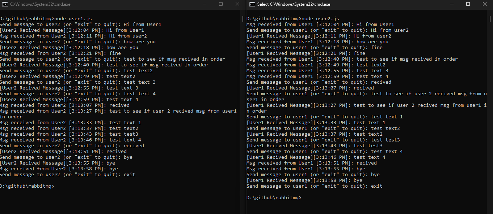
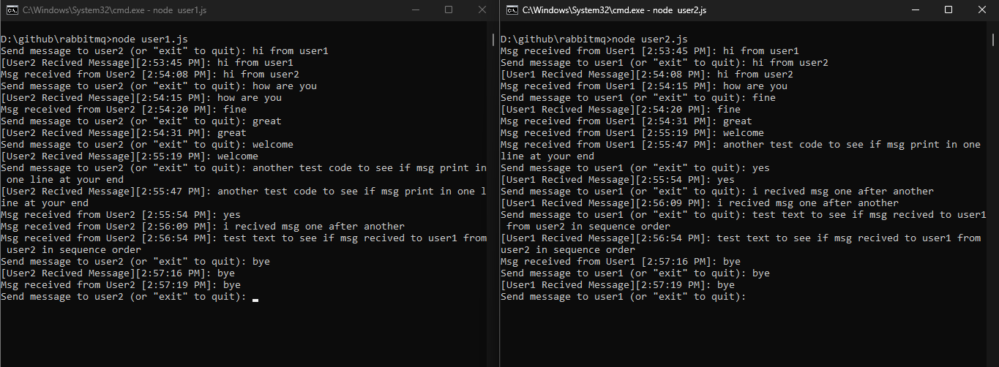

# RabbitMQ Chat Application


This repository contains a simple chat application built with RabbitMQ that allows two users to communicate with each other in real-time.

## Introduction

This project demonstrates how to implement a chat application using RabbitMQ messaging broker in a Node.js environment. In this application, users can exchange messages asynchronously using RabbitMQ queues.

## Getting Started

To run this chat application, follow these steps:

1. **Start RabbitMQ using Docker:** Ensure that Docker is installed on your machine. Open a terminal and run the following command to start RabbitMQ in a Docker container:

    ```bash
    docker run -it --rm --name rabbitmq -p 5672:5672 -p 15672:15672 rabbitmq:3.13-management
    ```

    This command will download and start a RabbitMQ container with the management plugin enabled. Port 5672 is used for the AMQP protocol, while port 15672 is used for accessing the RabbitMQ management UI.

2. **Clone the Repository:** Clone this repository to your local machine.

3. **Install Dependencies:** Navigate to the project directory and run the following command to install dependencies:

    ```bash
    npm install
    ```

4. **Start User1 (Publisher):** Open a terminal window/tab, navigate to the project directory, and run the following command:

    ```bash
    node user1.js
    ```

5. **Start User2 (Subscriber):** Open another terminal window/tab, navigate to the project directory, and run the following command:

    ```bash
    node user2.js
    ```

6. **Begin Chatting:** Start typing your messages in each user's terminal window/tab. Messages will be exchanged between users in real-time. You will receive an acknowledgment when the other user receives your message.

## Screenshots

Below are screenshots demonstrating the chat application in action:

- 
- 
- 


## Message Format and Acknowledgment

- **Sending Messages:** When sending a message, you will see a timestamp indicating when the message was sent and an acknowledgment if the other user received the message successfully.

  Example:

```bash
Send message to user2 (or "exit" to quit): hi from user1
[User2 Recived Message][2:53:45 PM]: hi from user1
```


- **Receiving Messages:** When receiving a message, you will see a timestamp indicating when the message was received and the content of the message.

Example:

```bash
Msg received from User1 [2:53:45 PM]: hi from user1
```

## How It Works

In this application, each user acts as both a publisher and a subscriber. Messages sent by one user are published to a RabbitMQ queue, and the other user subscribes to that queue to receive the messages. RabbitMQ facilitates communication between users in real-time.

## Example Applications

Beyond this basic chat application, RabbitMQ can be used in various applications, such as:

- Real-time collaboration tools
- Multi-player gaming applications
- Distributed task queues for processing jobs asynchronously

## Contributing

Contributions are welcome! Feel free to open an issue or submit a pull request with any improvements or suggestions.